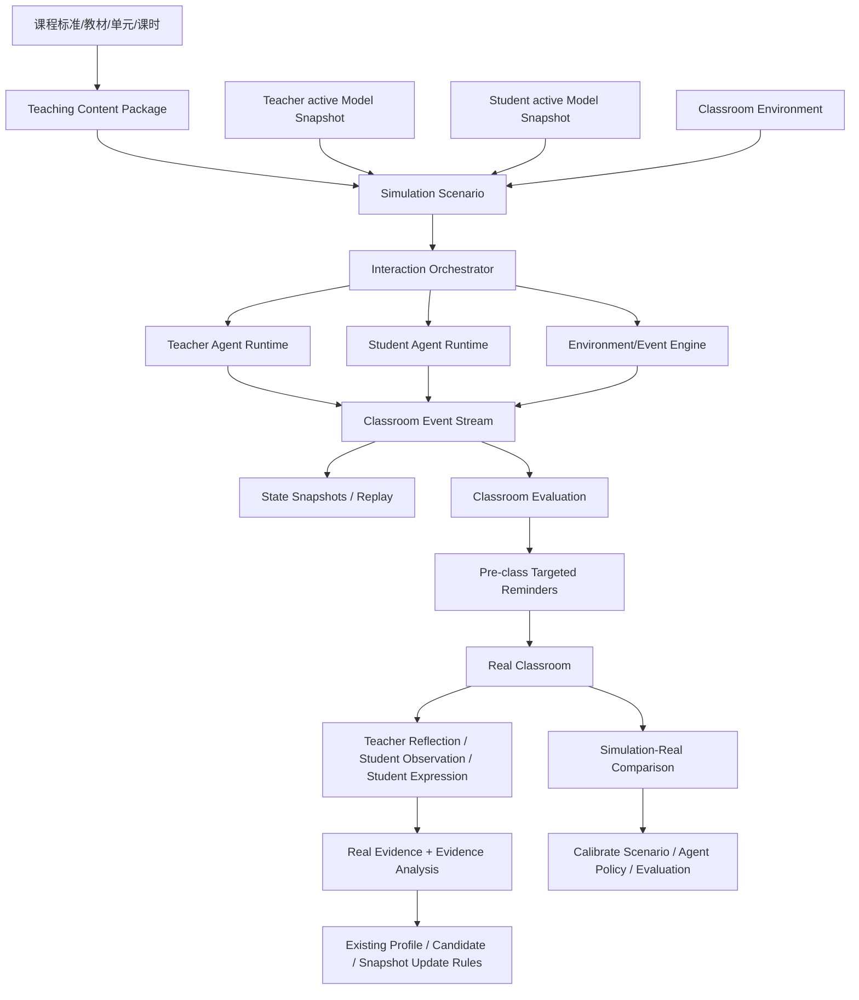
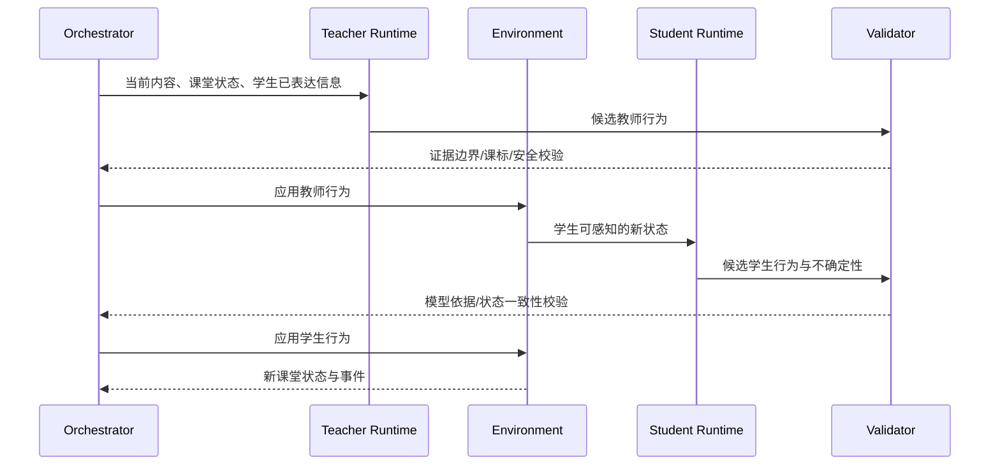

# 模拟课堂双主体互动与小程序落地设计

> 文档版本：V1.0（设计稿）
>
> 日期：2026-09-01
>
> 状态：仅设计，未开发、未创建集合、未部署
>
> 适用路线：阶段2 主体复现 → 阶段3 双主体互动 → 阶段4 模拟课堂 → 阶段5 实验验证

## 1. 设计结论

模拟课堂不应被设计成“两个大模型自由聊天”，而应被设计成一个以固定版本 Teacher / Student Subject Model 为主体基础，以课程内容包为目标约束，以课堂环境为状态空间，以课堂事件为可重放过程，以证据边界和不确定性为生成限制，以模拟—真实对照为最终校准方式的课堂运行系统。

小程序端具备开发可行性，但最适合承担教师入口、场景配置、短时互动、语音输入、过程反馈、课前提醒和课后真实反馈采集；长时多智能体推演、分支生成、状态管理和评价计算应放在云端异步执行。首个可行版本应继续遵守现有项目边界：小学一年级科学、8—15 分钟核心教学片段、观察/比较/简单探究、一个真实教师模型与一个虚拟学生模型的 1∶1 微型互动。

正式开发前必须先完成阶段2“主体复现”验证。若虚拟教师或虚拟学生在单主体典型情境中尚不能稳定复现真实主体，直接进入双主体互动会把主体误差、内容误差和互动误差混在一起，无法解释模拟结果。

## 2. 与当前项目的衔接

### 2.1 当前已经具备的基础

当前阶段1已经提供：

- 独立 Teacher_ID / Student_ID；
- Teacher `teacher_v1.0` 的 T1—T5、13 个变量；
- Student `student_v1.0` 的 S1—S6、17 个变量；
- 可追溯 Voice / Message / Evidence / Evidence Analysis；
- Evidence Profile、Gap、Contradiction、Stagnation 和 Model Change Candidate；
- 不覆盖历史的 active / superseded Model Snapshot；
- 规则驱动首次模型和持续 revision 自动激活；
- School / Class / membership 组织关系；
- 教师、学生持续采集和真实课堂后补充反馈的入口基础；
- researcher/admin 只读主体构建总览；
- 本地加密全量备份和追溯校验。

### 2.2 当前仍缺少的关键层

模拟课堂还需要增加，但本轮不开发：

1. 教学内容及课标对齐层；
2. 单主体复现评测层；
3. 课堂环境和任务材料状态层；
4. 双主体互动编排层；
5. 课堂事件与状态转换层；
6. 模拟过程评价层；
7. 模拟与真实课堂对照层；
8. 课前提醒—课后反馈—模型更新闭环。

### 2.3 不改变的项目原则

- 基础对象仍是教学内容、教师、学生；课堂不是第四个主体模型；
- Teacher Agent / Student Agent 是某个固定 Model Snapshot 在特定运行中的代理，不是新的研究主体；
- 内容编排器、环境引擎、事件引擎和评价器是系统组件，不是 Agent；
- 模拟事件不能直接成为真实 Teacher / Student Evidence；
- 单条真实 Evidence 仍不能直接定义或更新稳定主体特征；
- 不生成教师或学生综合总分、排名、人格类型或心理诊断；
- 模拟只能给出基于当前证据和情境的可能过程，不能宣称预测真实课堂必然发生什么。

## 3. 总体概念架构



双主体互动的最小运行单元是：

```text
固定 Teacher Snapshot
+ 固定 Student Snapshot
+ 固定 Content Package
+ 固定 Environment Version
+ 固定 Scenario Version
→ 一个可重放 Simulation Run
→ 一条有因果关系的 Classroom Event Stream
→ 一份带证据边界和不确定性的模拟评价
```

## 4. 课堂内容设计

### 4.1 课标依据

国家课程标准不是提示词中的一段背景说明，而应成为可版本化、可引用的正式内容约束。教育部 2022 年版义务教育课程方案和课程标准强调核心素养导向、课程内容结构化、主题/项目/任务组织，以及教学、学习和评价的一致性。科学课程应围绕科学观念、科学思维、探究实践、态度责任组织目标和活动。

教育部 2025 年《中小学科学教育工作指南》进一步强调真实情境、综合实践、“教学评”一体化和实验探究；2026 年《义务教育阶段科学教育“做中学”领航行动指南》强调以学生为主体、以兴趣为导向、以实践为路径，并形成“提出问题和假设—设计方案—搜集分析证据—得出结论并解释—制作改进—交流反思”的探究过程。

因此，模拟课堂不能只读取“课题名称”。每个 Content Package 至少要表达：

| 内容层 | 最小信息 |
|---|---|
| 学科与学段 | subject、grade_band、grade |
| 课标来源 | standard_id、standard_version、source_url、effective_date |
| 教材位置 | publisher、textbook_version、unit、lesson、page_reference |
| 核心概念 | core_concepts、concept_relations、essential_question |
| 素养目标 | science_concepts、science_thinking、inquiry_practice、attitude_responsibility |
| 学习目标 | 本片段希望学生经历和表现什么，不写成教师讲授清单 |
| 前置经验 | prerequisite_experience、likely_prior_conceptions |
| 典型困难 | misconceptions、observation_blind_spots、reasoning_difficulties |
| 学习任务 | task_sequence、materials、student_actions、teacher_moves |
| 评价依据 | observable_evidence、success_criteria、acceptable_variations |
| 安全约束 | material_safety、age_constraints、forbidden_actions |
| 版本信息 | content_version、review_status、created_at、updated_at |

### 4.2 首个内容包边界

首个研究内容建议沿用既有项目设定：

- 小学一年级科学；
- 8—15 分钟核心教学片段；
- 观察、比较或简单探究；
- 一个清晰的真实问题；
- 材料数量少、状态变化可描述；
- 至少允许学生出现两种合理但不同的观察路径；
- 至少包含一个典型前概念或遗漏信息；
- 教师可通过追问、等待、对比、再次观察或材料操作改变后续过程。

不建议首版直接选择：多知识点长课、复杂实验、多人协作项目、需要高精度物理仿真的内容，或以标准答案记忆为主的片段。

### 4.3 内容包不是教案

Content Package 描述“可以发生什么、受什么约束、怎样观察是否发生”，不替教师生成唯一教学流程。教师可以带入自己的教学设计；模拟系统只检查其与课标、内容逻辑、材料因果和学生当前模型之间的关系。

## 5. 课堂环境设计

课堂环境必须作为显式状态存在，否则互动会退化成没有材料、时间和空间约束的对话。

### 5.1 环境状态

| 状态类别 | 示例 |
|---|---|
| 物理环境 | 教室/实验区、座位、可见范围、噪声、光线 |
| 材料环境 | 材料清单、数量、位置、可操作状态、观察结果 |
| 时间环境 | 总时长、剩余时间、阶段、等待时长 |
| 社会环境 | 1∶1、全班、同伴、小组，发言机会和互动规则 |
| 任务环境 | 当前问题、当前步骤、已完成操作、未完成目标 |
| 信息环境 | 学生已看到/听到的信息，教师已获得的学生反应 |
| 安全环境 | 禁止操作、需要成人干预的条件、材料风险 |

### 5.2 科学探究环境的特殊要求

- 材料结果应由确定性规则或可解释的受控随机规则产生，不能由 Agent 随口决定；
- 学生只能基于其当前可见、可听、可操作的信息作出反应；
- 教师不能提前获得学生尚未表达的内部状态；
- 观察遗漏、注意转移和操作失败可以发生，但必须能说明触发条件和不确定性；
- 同一材料、同一操作和同一环境版本应得到可重放的核心结果；
- 环境噪声和随机性必须记录 seed，支持重复运行和对照实验。

## 6. 课堂行为与课堂事件

### 6.1 事件是课堂的基本记录单位

模拟课堂应采用 event sourcing：每一次可观察行为都写成事件，课堂状态由事件顺序推进。这样才能回放、比较、定位分歧，并与真实课堂观察对照。

课堂事件不是 Evidence。它首先是一次模拟运行中的过程记录。

### 6.2 事件分类 V1.0

| 事件主体 | 事件类型示例 |
|---|---|
| Teacher | introduce_task、ask_question、probe_reasoning、give_hint、revoice、wait、give_feedback、redirect_attention、organize_comparison、summarize |
| Student | observe、notice、predict、answer、explain、ask_question、express_uncertainty、revise_idea、manipulate_material、seek_help、respond_to_peer、disengage |
| Environment | material_revealed、observation_result、operation_success、operation_failure、time_warning、noise_change |
| System | state_checkpoint、branch_created、safety_intervention、simulation_paused、simulation_completed |

### 6.3 事件最小结构

```text
event_id
run_id
sequence
actor_type
actor_runtime_id
event_type
content
target_actor_ids[]
content_node_id
task_step_id
state_before_ref
state_after_ref
caused_by_event_ids[]
evidence_basis[]
confidence
uncertainty
data_origin = simulated
created_at
```

`evidence_basis` 只允许引用该 Agent 被授权使用的 Model Snapshot 变量、安全内容摘要和场景状态，不把完整原始 Evidence 或内部 reasoning 暴露到前端。

### 6.4 运行时状态与持久主体模型分离

课堂中会产生短时状态，例如：

- 当前注意对象；
- 当前理解假设；
- 当前表达意愿；
- 当前困惑点；
- 当前任务完成程度；
- 最近一次教师支架；
- 已观察到的材料信息。

这些状态属于某次 Simulation Run，不等于 Student Model 的稳定变量，也不能写回 active Snapshot。结束后只能进入模拟评价；真实课堂出现的对应行为还要经过真实采集、Evidence Analysis 和现有更新规则。

## 7. 双主体互动机制

### 7.1 双主体的含义

V1.0 的“双主体”固定指：

```text
一个 Teacher Agent Runtime
↔
一个 Student Agent Runtime
```

二者分别绑定某个不可变的 Teacher / Student active Snapshot。内容、环境、事件和评价是互动条件与记录机制，不是新的 Agent。

### 7.2 单轮互动流程



### 7.3 生成约束

每个 Agent 的输出至少受五层约束：

1. **主体约束**：只能使用固定 Snapshot 中已有描述、情境和不确定性；
2. **内容约束**：不能超出 Content Package 当前内容和任务；
3. **可见性约束**：只能使用该主体在当前事件序列中获得的信息；
4. **行为约束**：行为必须属于当前角色可以执行的课堂动作；
5. **安全约束**：不得生成危险材料操作、羞辱性反馈、诊断标签或越权身份信息。

### 7.4 不确定性和多分支

主体模型不是确定性脚本。对证据不足或存在多个可能反应的变量，系统应生成 2—3 个有明确差异来源的候选分支，而不是伪造一个“最真实答案”。

分支需标明：

- 触发条件；
- 依赖的主体变量；
- 证据支持程度；
- 情境假设；
- 关键不确定性；
- 哪一种真实课堂证据可以验证或否定该分支。

## 8. 课堂评价设计

### 8.1 评价对象

课堂评价不对教师或学生作能力评级，而是评价：

1. 当前教学设计与课标/内容目标是否对齐；
2. 当前互动是否给学生提供了观察、思考、表达和修正机会；
3. 教师行为是否对学生真实反应作出适应性回应；
4. 学生反应是否能被当前 Student Model 和课堂状态解释；
5. 模拟过程自身是否可信、可追溯、存在多大不确定性；
6. 模拟与真实课堂之间的差异在哪里。

### 8.2 四层评价框架

| 评价层 | 核心问题 | 输出 |
|---|---|---|
| 内容对齐 | 是否对应课标、核心概念、探究过程和本片段目标 | alignment findings |
| 互动过程 | 是否出现有效提问、等待、支架、证据交流、观点修正 | event-based observations |
| 主体复现 | Agent 行为是否在模型边界内，是否像对应真实主体 | fidelity findings + uncertainty |
| 模拟效度 | 模拟事件与真实课堂事件是否一致，偏差来自哪里 | simulation-real discrepancy |

### 8.3 评价输出原则

- 不输出教师总分、学生总分或排名；
- 不把一次模拟失败归因为稳定教师能力或学生能力；
- 每条提醒必须引用具体事件、内容节点和模型边界；
- 区分“课标不对齐”“环境条件不足”“主体模型证据不足”“互动策略风险”；
- 把“未能判断”作为合法结果；
- 对关键结论显示可信度和主要不确定性；
- 评价首先用于改进下一次教学行动，其次才用于研究汇总。

## 9. 核心使用场景：课前模拟—提醒—课后反馈—模型更新

### 9.1 课前准备

教师在小程序中选择：

- School / Class；
- 课标版本与学科；
- 教材、单元、课时；
- 本次 8—15 分钟教学片段；
- 目标 Student 或经授权的匿名 Student 组合；
- 教学目标、任务材料和教师已有设计；
- 模拟模式：自动推演或教师真人参与互动。

系统在开始时冻结：

- Teacher Snapshot ID；
- Student Snapshot ID；
- Content Package Version；
- Environment Version；
- Scenario Version；
- 随机 seed；
- 模拟时间和操作者。

后续模型更新不会悄悄改变已经开始的模拟结果。

### 9.2 课前模拟

自动推演模式：Teacher Agent 与 Student Agent 运行 2—3 条受控分支。

教师参与模式：真实教师通过文字或单次不超过当前录音限制的语音向虚拟 Student 讲解、提问或反馈，系统只生成 Student 反应和环境变化。

首版建议优先开发教师参与模式，因为它更接近“低风险试讲”，也减少 Teacher Agent 复现误差对结果的叠加。

### 9.3 课前针对性提醒

系统在模拟结束后只给 1—3 条高优先级提醒，每条包括：

```text
提醒标题
可能发生的课堂情境
对应内容/课标目标
触发该提醒的模拟事件
涉及的 Teacher / Student Model 变量
为什么需要关注
可尝试的下一步教学动作（不提供唯一标准答案）
可信度
主要不确定性
```

示例：

> 当前学生模型显示其更容易从生活经验解释观察结果。本次模拟中，学生在看到局部现象后立即给出结论，而教学设计直接进入答案确认。课前可预留一次“你还看到了什么”和一次材料对比，让学生说明判断依据。该提醒来自本次模拟事件，不表示学生必然会这样回答。

### 9.4 真实课堂实施

教师根据提醒自行决定是否调整设计。系统不要求教师照单执行，也不把“采纳提醒”作为评价指标。

真实课堂发生时，V1.0 不要求小程序持续录制整堂课。可先使用低负担方式：

- 教师课后教学反思；
- 教师学生观察记录；
- 学生课后“再说一说”；
- 研究者结构化课堂事件观察；
- 必要时采集经过伦理授权的短片段材料。

### 9.5 课后教师反馈

教师在小程序中完成一次与本次 `real_class_session_id` 绑定的课后反馈，提示尽量围绕真实事件：

1. 学生实际出现了什么反应？
2. 与课前模拟一致和不一致的地方是什么？
3. 教师当时采取了什么行动？
4. 学生随后有什么变化？
5. 哪些情况现在仍不能确定？

课后教师语音继续走现有正式链：

```text
Voice → ASR → Message
→ 内容路由
→ Teacher Evidence / Student Observation Evidence
→ Evidence Analysis
→ Profile / Gap / Candidate
→ 满足统一规则时生成并激活新 Snapshot
```

教师反思可更新 Teacher Model；其中关于学生的观察必须作为独立来源、明确观察对象和真实课堂情境，不能直接替代学生本人的 Evidence。学生课后真实表达可进入 Student Evidence。所有更新仍受既有 supportive、数量、独立记录、跨情境/时间和矛盾门槛约束。

### 9.6 两条互不混淆的更新链

```text
真实课后证据
→ 更新 Teacher / Student Subject Model

模拟结果 vs 真实课堂结果
→ 更新模拟策略、内容包、事件规则和效度评估
```

模拟产生的 Student 回答、Teacher Agent 行为、系统评价和提醒不得写入真实 `evidence`。否则系统会用自己的生成结果训练自己的主体模型，形成不可审计的循环污染。

## 10. 其他可能使用场景

### 10.1 教师个人微格试讲

教师面对一个虚拟 Student 完成 8—15 分钟片段，重点练习提问、等待、追问、反馈和材料组织。系统只给事件级提醒，不生成教师等级。

### 10.2 集体备课与同课异构

同一 Content Package、同一 Student Snapshot、同一环境 seed 下运行两种教学设计，比较互动轨迹和关键分歧，而不是比较教师排名。

### 10.3 新教师情境练习

使用明确标记的合成 Student Profile 或经脱敏授权的研究型 Student Snapshot，练习典型但非唯一的学生反应。禁止把合成 Student 当作真实儿童。

### 10.4 教研员课例分析

研究者查看模拟事件树、课标节点、教师行为和学生反应之间的因果链，选择值得进入真实课堂验证的假设。

### 10.5 模拟—真实对照研究

对同一教学片段保存模拟版本、真实课堂事件和模型版本，分析命中、遗漏和偏差，研究主体模型、环境规则或内容包哪一层需要修正。

### 10.6 课堂突发事件预演

在受控事件库中加入材料不足、学生回答偏离预期、观察结果不一致、时间不足等情境，检验教学设计的适应路径。首版不模拟高风险安全事件。

## 11. 小程序端开发部署可行性

### 11.1 适合放在小程序端

- 教师身份和 Class 选择；
- Content Package / 教学片段选择；
- 场景参数配置；
- 逐轮文字或短语音输入；
- 虚拟学生回应展示；
- 当前材料和任务状态展示；
- 模拟进度、暂停和恢复；
- 关键课堂事件时间线；
- 课前 1—3 条提醒；
- 课后教师真实反馈采集；
- 个人历史模拟报告入口；
- researcher/admin 的安全研究总览入口。

### 11.2 不适合直接放在小程序端

- 长上下文多 Agent 自主循环；
- 一次性生成完整 40 分钟课堂；
- 大量学生并发与复杂群体行为；
- 复杂物理实验、3D 环境或视频实时识别；
- 在客户端保存完整 Subject Snapshot、原始 Evidence 或模型密钥；
- 由前端直接决定模型变量、证据充分性或是否更新 Snapshot。

### 11.3 推荐技术分工

```text
小程序
  → 登录、配置、短语音/文字、状态展示、提醒、课后反馈

Cloud Functions/API
  → 授权、Content Package、Run 创建、单轮互动、报告读取

异步 Simulation Orchestrator
  → 多轮编排、分支、状态压缩、失败重试、幂等

AI / Rule Engine
  → Teacher/Student 候选行为、内容对齐、事件校验、评价

Cloud Database/Storage
  → 版本化配置、Run、Events、State、Reports、真实采集材料
```

### 11.4 性能与成本判断

当前 CloudBase AI 和 120 秒云函数适合单轮或短批处理，不适合把完整模拟放进一次云函数调用。建议：

- 每轮生成后立即保存事件和状态；
- 使用 `run_id + sequence` 保持幂等；
- 前端轮询或订阅运行状态，不保持超长请求；
- 使用结构化状态摘要，不在每轮重复发送全部历史；
- 缓存固定 Content Package 和 Snapshot 安全摘要；
- 先以 1∶1、6—12 个关键轮次验证；
- 自动分支在后台异步运行，报告完成后通知教师；
- 记录每轮模型、token、耗时和失败信息，以便控制成本；
- 不以降低主体证据约束和评价门槛换取速度。

### 11.5 小程序产品页面设想

以下均为未来设计候选，不在本轮创建：

| 页面 | 职责 |
|---|---|
| `simulation-home` | 课前模拟入口、最近运行和课后待反馈 |
| `simulation-setup` | 选择班级、内容、片段、Student 和模式 |
| `simulation-run` | 逐轮互动、材料状态、事件反馈 |
| `simulation-report` | 总结、关键事件、提醒、不确定性 |
| `post-class-feedback` | 关联真实课次的教师反思和学生观察 |
| `simulation-compare` | researcher 查看模拟—真实差异 |

普通 Guardian / Student 端首版不开放模拟课堂管理入口。Student 只在已有伦理范围内参与真实采集，不查看教师课前诊断报告。

## 12. 建议的数据结构

以下均是设计候选，当前数据库尚未创建。

### 12.1 `curriculum_standards`

保存官方课标引用和结构化节点：standard_id、subject、grade_band、version、source_url、effective_date、core_literacy_dimensions、content_domains、learning_requirements、status、created_at、updated_at。

不建议把整份课标交给模型自由检索后直接生成目标；应由研究团队建立经过核对的结构化节点并保存来源页码/章节。

### 12.2 `content_packages`

保存学科、教材、单元、片段、核心概念、课标映射、任务、材料、典型困难、评价证据、安全规则和版本。

唯一逻辑键建议包含：subject + grade + textbook_version + unit + lesson + content_version。

### 12.3 `simulation_scenarios`

保存 Content Package 的具体运行配置：scenario_id、content_package_id、scenario_version、duration_minutes、interaction_mode、environment_config、initial_event、branch_policy、stop_conditions、status。

### 12.4 `simulation_runs`

```text
run_id
scenario_id / scenario_version
teacher_subject_id / teacher_snapshot_id
student_subject_ids[] / student_snapshot_ids[]
content_package_id / content_version
environment_version
operator_user_id
mode
random_seed
status
current_sequence
started_at / completed_at
is_test
created_at / updated_at
```

运行记录只引用 Snapshot，不复制并暴露完整主体模型。

### 12.5 `simulation_events`

保存第 6 节的事件结构。唯一键建议为 `run_id + sequence`，同一事件重试不得创建重复记录。

### 12.6 `simulation_state_snapshots`

定期保存内容、环境、Teacher Runtime、Student Runtime 和互动状态摘要，用于恢复和回放。它是模拟运行状态，不是 `model_snapshots`。

### 12.7 `simulation_evaluations`

保存内容对齐、互动过程、主体复现和模拟效度评价。每条 finding 必须引用 event_ids、content_node_id、评价规则、可信度和不确定性。

### 12.8 `real_class_sessions`

连接真实课次、School / Class、Content Package、Teacher / Student Subjects、时间和授权范围。它不是新的主体模型，而是一次真实课堂事件容器。

### 12.9 `simulation_real_links`

保存 run_id 与 real_class_session_id 的对照关系、关键事件映射、命中/遗漏/新增事件、偏差来源和研究者核验状态。

## 13. 授权、隐私和研究有效性

### 13.1 授权

- Teacher 只能对本人 Teacher Subject 和被授权的 Class 发起模拟；
- 不能仅凭 Class membership 读取完整 Student Snapshot；
- Agent Runtime 使用经云函数裁剪的安全模型表示；
- Guardian 不能进入其他 Student 或教师模拟报告；
- researcher/admin 的跨主体比较必须是受控只读能力；
- 模拟运行不得返回绑定码、线下编号 hash、OpenID、原始 Evidence 或内部 Analysis reasoning。

### 13.2 未成年人保护

- 默认使用 Student_ID / research alias，不显示真实姓名和学号；
- 对真实 Student Snapshot 用于课堂模拟的目的、范围和保存期限需要纳入线下伦理与知情同意；
- 课前提醒不应向教师展示儿童的敏感原始表达；
- 不生成心理诊断、家庭价值判断、人格类型或公开排名；
- 输出必须标明“模拟可能性，不是对该学生的确定判断”。

### 13.3 防止模型循环污染

所有模拟记录固定 `data_origin = simulated`，并与真实 Evidence 集合隔离。即使真实教师亲自参与课前模拟，其行为在 V1.0 也只作为 rehearsal event 保存，不自动进入 Teacher Evidence；是否把真实教师在模拟情境中的行为作为独立研究证据，必须经过后续研究协议和效度验证。

### 13.4 版本和可复现性

一份模拟报告必须能够回答：

- 使用了哪个 Teacher / Student Snapshot；
- 使用了哪个课标、内容包和场景版本；
- 使用了哪个 AI / rule protocol；
- 使用了哪个环境版本和随机 seed；
- 每条提醒由哪些事件触发；
- 模拟与真实课堂为何出现差异；
- 后续哪些真实证据改变了主体模型。

## 14. 反向审视：当前教师/学生采集与建模还应改进什么

模拟课堂会暴露当前采集体系的一个核心不足：现有 Teacher / Student 模型已经能描述主体，但大量证据缺少“针对什么教学内容、在哪一类课堂任务、与谁互动、当时发生了什么”的标准化上下文。为了未来可靠互动，建议按优先级改进。

### 14.1 P0：模拟开发前必须补齐

#### A. 增加内容与课标上下文

现有 Evidence 的 `context` 以 Analysis 原文为主，不足以稳定关联学科、年级、单元、课时和任务。未来真实采集应逐步增加：

- subject_area；
- grade；
- standard_id / content_node_id；
- unit / lesson_topic；
- task_type；
- real_class_session_id；
- interaction_mode；
- participant_role；
- material_context。

这些字段是证据上下文，不是把入口硬绑定模型变量。

#### B. 先建立主体复现评测集

为 Teacher 和 Student 各选取少量未进入建模的真实典型情境，冻结 Snapshot 后预测其可能回应，再与真实回应对照。至少评价：

- 内容是否一致；
- 行动/表达风格是否相似；
- 是否遵守不确定性边界；
- 是否出现模型没有依据的补写；
- 跨情境是否仍能保持合理差异。

只有达到预设复现门槛的 Snapshot 才进入双主体模拟。

#### C. 建立真实课堂事件容器

当前 Session 偏采集会话，尚不能表达一节真实课的内容版本、事件时间线和模拟对照。建议先设计 `real_class_sessions`，再把教学反思、学生观察、学生表达和研究者观察关联到同一真实课次。

#### D. 落地 `collection_events`

Voice / Message 已经可用，但未来需要把一次真实课堂观察、一次材料操作、一次学生回答和一次教师反馈放入同一个事件容器，避免只凭语音文本还原课堂。

### 14.2 P1：首轮真人试采后补强

#### A. 学生模型增加真实任务行为证据

当前 Student 首次采集主要依赖自然语音。未来应增加低负担、儿童友好的观察、比较、预测、操作和解释任务，以及研究者/教师结构化行为观察。行为记录必须与学生自述分开，不能把教师观察当成儿童本人的回答。

#### B. 教师采集更多“决策—行动—结果”链

教师反思不只问“怎么看”，还应围绕真实课堂事件采集：看到了什么、如何判断、采取了什么行动、学生如何变化、事后如何解释、还有什么不确定。这样 Teacher Model 才能支持动态决策，而不是只描述教学理念。

#### C. 增加关系和互动情境覆盖

同一教师面对不同学生、同一学生面对不同任务会有不同表现。模型更新应继续以主体变量为核心，但 Evidence 需要明确互动对象、任务和课堂阶段，避免把情境反应错误概括成稳定特征。

#### D. 加强不一致证据采集

当前 Contradiction 可以阻断自动 revision，但采集端还缺少自然的“为什么这次不同”提示。未来可在真实事件后询问是否由内容难度、材料、同伴、时间、情绪或教师支架造成，不急于把差异解释为模型错误。

#### E. 保留 no-match 并建设框架检验

模拟课堂会产生大量不落入现有 T/S 变量但与内容、环境或关系有关的事件。应继续保留 unmatched，后续聚类时区分：内容模型缺口、环境状态缺口、事件类型缺口和主体框架缺口，不自动增加 T6 / S7。

### 14.3 P2：模拟课堂验证后再决定

- 是否把教师参与模拟时的真实行为作为独立低权重 Evidence 来源；
- 是否引入一名教师对多个 Student Runtime；
- 是否建立班级群体状态，但不得建立“Class 人格模型”；
- 是否增加作品、图片、短视频和自动行为识别；
- 是否建立 Targeted Supplement 状态机；
- 是否按学科/内容类型定义不同的最低证据结构；
- 是否把 Student-M2 / Teacher-T2 的更新节奏与真实课次绑定。

## 15. 分阶段开发路线建议

### Phase 0：研究与协议准备

- 选择一个一年级科学片段；
- 建立 Content Package V1.0；
- 确定课堂事件 taxonomy；
- 确定单主体复现评测集和通过门槛；
- 明确 Student Snapshot 使用授权；
- 明确模拟记录与真实 Evidence 的物理隔离规则。

### Phase 1：主体复现

- Teacher Snapshot → 典型情境候选行为；
- Student Snapshot → 典型内容任务候选反应；
- 与真实保留样本对照；
- 记录误差来自模型、内容、环境还是生成协议；
- 不进入双主体自动循环。

### Phase 2：离线 1∶1 双主体事件流

- 固定 Teacher / Student / Content / Environment 版本；
- 运行 6—12 个关键事件；
- 生成 2—3 个分支；
- 事件、状态和依据可回放；
- researcher 先验证，不开放正式教师入口。

### Phase 3：小程序课前微型模拟

- 教师选择内容和 Student；
- 教师真人参与逐轮试讲；
- 虚拟 Student 回应；
- 输出 1—3 条课前提醒；
- 不自动写 Teacher / Student Evidence。

### Phase 4：课后真实反馈闭环

- 建立 real_class_session；
- 教师反思、学生观察和学生表达关联真实课次；
- 进入现有 Evidence / Analysis / Profile / Candidate / Snapshot 链；
- 建立模拟—真实事件对照；
- 评估提醒是否有用、模拟是否更接近真实。

### Phase 5：多学生和课堂级模拟

只有 1∶1 复现和互动效度通过后，再扩展到多个 Student Runtime、同伴互动、课堂管理、群体状态和完整课堂。多学生只是多个独立 Student Subject Runtime 的组合，不创建统一“班级人格”。

## 16. 首版验收标准

### 16.1 主体与内容

- Teacher / Student Snapshot 版本冻结且可追溯；
- Teacher 13 / Student 17 变量结构不被模拟引擎修改；
- Content Package 有官方课标来源、教材位置、任务和评价依据；
- 证据不足的主体变量能够返回不确定，而不是自由补写。

### 16.2 互动与事件

- 每个行为都形成顺序稳定的事件；
- 事件包含 actor、状态前后、因果来源和不确定性；
- 同一 seed 和固定版本可重放核心过程；
- 学生不能使用未观察到的信息；
- 环境结果不由 Agent 随意决定；
- 支持暂停、恢复和失败重试，不重复事件。

### 16.3 评价与提醒

- 每条提醒引用具体事件和内容节点；
- 提醒数量控制在 1—3 条；
- 不输出能力分、排名、人格或诊断；
- 区分模型证据不足与教学设计风险；
- 能明确说明哪些真实课堂证据可验证提醒。

### 16.4 数据安全

- `data_origin = simulated` 的记录不能进入真实 Evidence；
- Guardian / Teacher 不能越权读取其他 Student；
- 前端不返回原始 Evidence、Analysis reasoning 或身份哈希；
- Simulation Run、Event、Report 可纳入全量备份；
- 删除/撤回策略与线下伦理流程一致。

### 16.5 真实效度

- 至少完成若干次相同内容的模拟—真实事件对照；
- 能区分命中、遗漏、错误预测和无法判断；
- 教师能够判断提醒是否具体、可执行且不造成额外负担；
- 真实课后证据能通过现有规则更新模型，但模拟事件不能；
- 研究者能够复核一次模拟使用的全部版本和依据。

## 17. 正式开发前需要研究团队确认的决策

1. 首个一年级科学课题、教材版本和课标节点；
2. 首版采用“真实教师 + 虚拟学生”还是“双虚拟主体自动推演”为主；建议前者；
3. Student Snapshot 是单个真实学生、脱敏典型学生，还是明确标记的合成 Student；
4. 真实课堂采用何种最低负担的事件记录方式；
5. 主体复现由谁评价、采用哪些保留样本和通过门槛；
6. 课前提醒是否只对教师本人展示；建议是；
7. 模拟中真实教师行为未来是否可成为研究 Evidence；V1.0 建议否；
8. 模拟—真实对照的伦理、保存期限、撤回和访问规则；
9. 哪些课堂事件允许自动评价，哪些必须保留研究者复核；
10. 达到什么实证标准后才允许从 1∶1 扩展到多学生课堂。

## 18. 资料依据

- 项目内部约束：[AGENTS.md](../AGENTS.md)
- 当前技术架构：[ARCHITECTURE.md](./ARCHITECTURE.md)
- 当前开发状态：[DEVELOPMENT_STATUS.md](./DEVELOPMENT_STATUS.md)
- 当前数据模型：[DATA_MODEL.md](./DATA_MODEL.md)
- 数据采集小程序总览：[DATA_COLLECTION_MINIPROGRAM_OVERVIEW.md](./DATA_COLLECTION_MINIPROGRAM_OVERVIEW.md)
- 既有项目研究说明：[基于多智能体协同技术的模拟课堂教学研究.docx](./基于多智能体协同技术的模拟课堂教学研究.docx)
- [教育部：义务教育课程方案和课程标准（2022年版）](https://www.moe.gov.cn/srcsite/A26/s8001/202204/t20220420_619921.html)
- [教育部：中小学科学教育工作指南（2025）](https://www.moe.gov.cn/srcsite/A29/202501/t20250122_1176589.html)
- [教育部：义务教育阶段科学教育“做中学”领航行动指南（2026）](https://www.moe.gov.cn/srcsite/A29/202608/t20260803_1445982.html)

## 19. 一句话原则

**模拟课堂不是让模型替真实课堂作结论，而是让固定版本的真实主体模型在有课标、有内容、有环境、有事件、有评价的受控课堂中先产生可检验的可能过程，再用真实课堂证据校准主体模型和模拟机制。**
